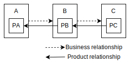
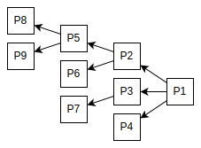

# Traceability Extension

Version: 0.9.0

[JA](README_ja.md)


## Overview

Traceability in the carbon footprint of a product means breaking down the target product into its component parts down to its very end, and being able to recognize each carbon footprint by tracing the tree structure from the trunk to the branches. The product footprint described in [Technical Specifications for PCF Data Exchange](https://wbcsd.github.io/tr/data-exchange-protocol/) is basically designed to represent the carbon footprint of your own products. If you want to use this to achieve traceability, you need to have a parts structure in some application and associate a product footprint with each node. On the other hand, if the product footprint can include the product footprint of its component parts as a breakdown of its carbon footprint, it becomes possible to represent traceability in the data model itself.

The problem here is the visibility of the data. As long as the product footprint is data owned by the company over its entire area, there will be no problem if access control to it is complete (even if it is incomplete, it will be within the scope of the company's responsibility). However, if the product footprint contains a breakdown, it means that it may contain data owned by other companies. Therefore, it is not possible to simply nest product footprints. I think there are two ways to do this. One is to include only the product footprint identifier (PfId). With this method, authentication is required for each data-holding company to obtain the breakdown data, so your company's information will not be made public at the discretion of other companies. The other method is to include only the carbon footprint without including company or product information. This method assumes that upstream companies have agreed to the disclosure of part of the data to other companies, but since it focuses only on the breakdown of the carbon footprint and does not allow companies to be identified, I think it may be possible to minimize the risk.


## Data Model

The data model is basically a subset of `ProductFootprint` (Tech Spec ver2). In other words, `id` is the data identifier, `companyIds` identifies the data-owning company, and `productIds` identifies the product. Carbon footprint allows you to define `pCfExcludingBiogenic` and `pCfIncludingBiogenic`, which are aggregate values ​​for the entire product. Therefore, we will not explain each property here. However, all properties are **optional**. The reason for defining them in this way is to define the breakdown within the scope of what is permitted to be disclosed to other companies. If permission is unknown, only `id` can be defined and data acquisition can be left to the data-owning company.

The only difference with `ProductFootprint` is that this data model itself can be nested by `breakdownPfs`. In other words, the data received from upstream companies can be nested in order to construct a tree-structured data.

This data is called `ProductFootprintFragment`. Its definition is as follows.

<table>
  <thead>
    <tr><td colspan=3><b>Property Name</b></td><td><b>Type</b></td><td><b>Required</b></td></tr>
  </thead>
  <tbody>
    <tr><td colspan=3><b>id</b></td><td>String&lt;uuid&gt;</td><td>Optional</td></tr>
    <tr><td colspan=3><b>created</b></td><td>String&lt;date-time&gt;</td><td>Optional</td></tr>
    <tr><td colspan=3><b>updated</b></td><td>String&lt;date-time&gt;</td><td>Optional</td></tr>
    <tr><td colspan=3><b>validityPeriodStart</b></td><td>String&lt;date-time&gt;</td><td>Optional</td></tr>
    <tr><td colspan=3><b>validityPeriodEnd</b></td><td>String&lt;date-time&gt;</td><td>Optional</td></tr>
    <tr><td colspan=3><b>companyName</b></td><td>String</td><td>Optional</td></tr>
    <tr><td colspan=3><b>companyIds</b></td><td>Array&lt;String&gt;</td><td>Optional</td></tr>
    <tr><td colspan=3><b>productDescription</b></td><td>String</td><td>Optional</td></tr>
    <tr><td colspan=3><b>productIds</b></td><td>Array&lt;String&gt;</td><td>Optional</td></tr>
    <tr><td colspan=3><b>productCategoryCpc</b></td><td>String</td><td>Optional</td></tr>
    <tr><td colspan=3><b>productNameCompany</b></td><td>String</td><td>Optional</td></tr>
    <tr><td colspan=3><b>pcf</b></td><td>Object</td><td>Optional</td></tr>
    <tr><td></td><td colspan=2><b>declaredUnit</b></td><td>String</td><td>Optional</td></tr>
    <tr><td></td><td colspan=2><b>pCfExcludingBiogenic</b></td><td>String</td><td>Optional</td></tr>
    <tr><td></td><td colspan=2><b>pCfIncludingBiogenic</b></td><td>String</td><td>Optional</td></tr>
    <tr><td></td><td colspan=2><b>referencePeriodStart</b></td><td>String&lt;date-time&gt;</td><td>Optional</td></tr>
    <tr><td></td><td colspan=2><b>referencePeriodEnd</b></td><td>String&lt;date-time&gt;</td><td>Optional</td></tr>
    <tr><td></td><td colspan=2><b>primaryDataShare</b></td><td>Number</td><td>Optional</td></tr>
    <tr><td></td><td colspan=2><b>dqi</b></td><td>String&lt;date-time&gt;</td><td>Optional</td></tr>
    <tr><td></td><td></td><td><b>coveragePercent</b></td><td>Number</td><td>Optional</td></tr>
    <tr><td></td><td></td><td><b>technologicalDQR</b></td><td>Number</td><td>Optional</td></tr>
    <tr><td></td><td></td><td><b>temporalDQR</b></td><td>Number</td><td>Optional</td></tr>
    <tr><td></td><td></td><td><b>geographicalDQR</b></td><td>Number</td><td>Optional</td></tr>
    <tr><td></td><td></td><td><b>completenessDQR</b></td><td>Number</td><td>Optional</td></tr>
    <tr><td></td><td></td><td><b>reliabilityDQR</b></td><td>Number</td><td>Optional</td></tr>
    <tr><td colspan=3><b>breakdownPfs</b></td><td>Array&lt;ProductFootprintFragment&gt;</td><td>Optional</td></tr>
  </tbody>
</table>


## Use Case

### Disclosure of product footprint identifiers only



Consider a simple supply chain consisting of three companies, A, B, and C. Each company has its own products P<sub>A</sub>, P<sub>B</sub>, and P<sub>C</sub>, which form a parts structure of P<sub>C</sub> → P<sub>B</sub> → P<sub>A</sub>. However, C, which is at the very bottom of the supply chain, only places orders with B and is unaware of A's existence. In this situation, A needs traceability of P<sub>C</sub> for reporting purposes.

First, C requests B to report the product footprint of P<sub>B</sub>. At this time, C asserts that it is also requesting traceability. Next, B requests A to report the product footprint of P<sub>A</sub> in order to calculate the product footprint of P<sub>B</sub>.

A completes the carbon footprint calculation for P<sub>A</sub> and sends the product footprint to B via [Action Events](https://wbcsd.github.io/tr/data-exchange-protocol/#api-action-events) or [Action ListFootprints](https://wbcsd.github.io/tr/data-exchange-protocol/#api-action-list).

```json
{
    "id": "6cfaceb2-a165-49b9-9e08-b66114663186",
    ...
    "companyIds": ["urn:uuid:593a6bb8-7ec7-4b20-851c-2ee6760b4561"],
    ...
    "productIds": ["urn:uuid:04e37960-3f25-4426-aa38-26456b7bc91d"],
    ...
    "pcf": {
        "declaredUnit": "kilogram", 
        "pCfExcludingBiogenic": "0.324",
        ...
    }
}
```

Once B has completed calculating its own carbon footprint, it will be ready to add it to P<sub>A</sub>'s carbon footprint and send P<sub>B</sub>'s product footprint, using this extension to express traceability.

However, since B is not authorized by A to disclose data to other companies, it will include only the product footprint identifier in the data.

```json
{
    "id": "8a3628a7-89c6-42e7-8155-b8022e8e1731",
    ...
    "companyIds": ["urn:uuid:3f1b6a64-5d3f-4af5-90c7-991714d52bdd"],
    ...
    "productIds": ["urn:uuid:b4167da7-f2fa-49af-8971-6da05fc07b3e"],
    ...
    "pcf": {
        "declaredUnit": "kilogram", 
        "pCfExcludingBiogenic": "3.521",
        ...
    },
    "extensions": [
        {
            "specVersion": "2.0.0",
            "dataSchema": "https://mill6-plat6aux.github.io/traceability-extension/schema.json",
            "data": {
                "breakdownPfs": [
                    {
                        "id": "6cfaceb2-a165-49b9-9e08-b66114663186"
                    }
                ]
            }
        }
    ]
}
```

When C receives the product footprint of P<sub>B</sub>, it can recognize that P<sub>B</sub>'s carbon footprint is dependent on one more component. To obtain traceability, it can refer to the id in this extension's `breakdownPfs` included in P<sub>B</sub>'s product footprint and request [Action GetFootprint](https://wbcsd.github.io/tr/data-exchange-protocol/#api-action-get) to the company that owns it.

Here, C does not know A and does not know the application endpoint, so it is impossible to obtain P<sub>A</sub>'s product footprint from the product footprint identifier alone. Therefore, a service is required that identifies the product and its owning company from the PfId and provides a process to obtain the product footprint. Please refer to Pathfinder Harmony for more information.

By the way, in this case, B entrusts access to A's product footprint to an external system, but if C enters into a contract with A and is granted access to P<sub>A</sub>'s product footprint, C will inevitably learn that P<sub>A</sub> is a component of P<sub>B</sub>. Some companies may want to avoid downstream companies knowing about their business relationships. In such cases, please refer to the next section, "Disclosure of Carbon Footprint Only."

### Disclosure of carbon footprint only

Consider a supply chain with the same structure as in the previous section. However, in this case, B does not want C to know about its business relationship with A.

If P<sub>A</sub>'s product footprint contains not only `companyIds` and `productIds`, but also `PfId`, it will cause problems if A allows C to provide the product footprint. In that case, it is sufficient to provide only the carbon footprint without including information that identifies such companies or products in the breakdown. In this way, only the minimum amount of information required to achieve traceability can be provided to downstream companies.

By the way, it is natural not to include information that identifies companies or products, but if only the carbon footprint is included, the information may not be meaningful in hotspot analysis. Therefore, I think that adding `productCategoryCpc` as in the example below is a measure to create useful information while minimizing risk.

```json
{
    "id": "8a3628a7-89c6-42e7-8155-b8022e8e1731",
    ...
    "companyIds": ["urn:uuid:3f1b6a64-5d3f-4af5-90c7-991714d52bdd"],
    ...
    "productIds": ["urn:uuid:b4167da7-f2fa-49af-8971-6da05fc07b3e"],
    ...
    "pcf": {
        "declaredUnit": "kilogram",
        "pCfExcludingBiogenic": "3.521",
        ...
    },
    "extensions": [
        {
            "specVersion": "2.0.0",
            "dataSchema": "https://mill6-plat6aux.github.io/traceability-extension/schema.json",
            "data": {
                "breakdownPfs": [
                    {
                        "productCategoryCpc": "43112",
                        "pcf": {
                            "declaredUnit": "kilogram",
                            "pCfExcludingBiogenic": "0.324"
                        }
                    }
                ]
            }
        }
    ]
}
```

However, in this case, since part of the data held by the upstream company will be provided to the downstream company, it will be necessary to obtain the upstream company's consent in advance.

### Disclosure up to the top of the supply chain

In the previous section, we considered a simple three-tiered supply chain, but in practice, the supply chain will become more complex, and traceability may be required by the most downstream company. In such cases, the `breakdownPfs` property can be used to express an unlimited breakdown.

For example, consider the following more complex product structure.



In this case, if traceability were to be expressed using the previous section [Disclosure of product footprint identifiers only](#disclosure-of-product-footprint-identifiers-only), it would look like this:

```json
{
    "id": "2c7cf12d-6391-46c8-a0d9-2b1fad57a516",
    ...
    "companyIds": ["urn:uuid:1f2364f2-faf1-4b56-a409-37c579da6b99"],
    ...
    "productIds": ["urn:uuid:a39a2e71-8a6e-4f72-80b8-5a1865f62449"],
    ...
    "pcf": {
        "pCfExcludingBiogenic": "1.348",
        ...
    },
    "extensions": [
        {
            "specVersion": "2.0.0",
            "dataSchema": "https://mill6-plat6aux.github.io/traceability-extension/shema.json",
            "data": {
                "breakdownPfs": [
                    {
                        "id": "38cfe971-b175-4c7b-980d-744a405c5e78",
                        "breakdownPfs": [
                            {
                                "id": "8b21d9c1-6a3f-4a65-8069-09560b1f03b8",
                                "breakdownPfs": [
                                    {
                                        "id": "8fcc0652-4360-4ca2-8a73-43ad95aa7148"
                                    },
                                    {
                                        "id": "0cdb9d6c-a863-47a9-9c44-006c6174649b"
                                    }
                                ]
                            },
                            {
                                "id": "981d220b-ee4b-4e85-8d21-5e170776cd6e"
                            }
                        ]
                    },
                    {
                        "id": "33b7e258-2813-4957-98f3-513be5f2411c",
                        "breakdownPfs": [
                            {
                                "id": "efdcf723-5f5f-4731-84ba-c9c2fa5d5918"
                            }
                        ]
                    },
                    {
                        "id": "7fc667d0-4317-4d18-a4e7-87c9dec7d563"
                    }
                ]
            }
        }
    ]
}
```

## Developers

[Takuro Okada](mailto:mill6.plat6aux@gmail.com)