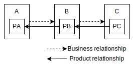
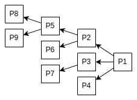

# Traceability Extension

Version: 0.9.0

[EN](README.md)


## 概要

製品のカーボンフットプリントにおけるトレーサビリティとは、対象の製品をその末端まで構成部品に分解し、その木構造を幹から枝葉へと辿るようにそれぞれのカーボンフットプリントを認識できるようにすることである。[Technical Specifications for PCF Data Exchange](https://wbcsd.github.io/tr/data-exchange-protocol/)に記載の製品フットプリントは、基本的に自社製品のカーボンフットプリントを表現するように設計されている。これを使用してトレーサビリティを実現しようとすれば、何らかのアプリケーションで部品構造を持っておき、その各ノードに対して製品フットプリントを関連づける必要がある。これに対して、製品フットプリントが、そのカーボンフットプリントの内訳として構成部品の製品フットプリントを内包できるようにすれば、データモデルそのものでトレーサビリティを表現することが可能となる。

ここで問題となるのは、データの可視性である。製品フットプリントがその全領域にわたって自社の保有データである限り、それに対するアクセス制御が完全であれば何も問題は起きない（万が一不完全であっても自社の責任範囲の範疇となる）。しかし、製品フットプリントが内訳を内包するということは、他社の保有データを含む可能性が生じるということである。そのため、単純に製品フットプリントを入れ子にするわけにはいかない。方法は２つあると考える。ひとつは製品フットプリント識別子（PfId）のみを内包するやり方である。このやり方では内訳データを取得するためには、それぞれのデータ保有企業への認証が発生するため、他社の裁量で自社の情報を公開されてしまうことはなくなる。もうひとつの方法は、企業や製品の情報を含めずカーボンフットプリントのみを内包するやり方である。このやり方では、データの一部を他社へ公開することに上流企業が同意していることが前提ではあるが、カーボンフットプリントの内訳のみにフォーカスしており企業を特定することはできないので、リスクを最小化できるのではないかと考える。


## データモデル

データモデルは、基本的に`ProductFootprint`（Tech Spec ver2）のサブセットである。すなわち、`id`をデータの識別子とし、`companyIds`によってデータ保有企業を特定し、`productIds`によって製品を特定する。カーボンフットプリントは製品全体の集計値である`pCfExcludingBiogenic`と`pCfIncludingBiogenic`を定義できるようにしている。そのため、各プロパティの説明はここでは省略する。ただし、すべてのプロパティは**オプショナル**とする。このように定義したわけは、他社に公開を許可された範囲で内訳を定義することを目的としたからである。許可が不明である場合は`id`のみを定義して、データ取得をデータ保有企業に委ねればよい。

`ProductFootprint`と唯一異なる点は、このデータモデル自体を`breakdownPfs`によってネストできる点である。すなわち上流企業から受け取ったデータを順番に入れ子にしていき、木構造のデータを構成できるようにしてある。

このデータを`ProductFootprintFragment`と呼称する。以下がその定義である。

<table>
  <thead>
    <tr><td colspan=3><b>Property Name</b></td><td><b>Type</b></td><td><b>Required</b></td></tr>
  </thead>
  <tbody>
    <tr><td colspan=3><b>id</b></td><td>String&lt;uuid&gt;</td><td>Optional</td></tr>
    <tr><td colspan=3><b>created</b></td><td>String&lt;date-time&gt;</td><td>Optional</td></tr>
    <tr><td colspan=3><b>updated</b></td><td>String&lt;date-time&gt;</td><td>Optional</td></tr>
    <tr><td colspan=3><b>validityPeriodStart</b></td><td>String&lt;date-time&gt;</td><td>Optional</td></tr>
    <tr><td colspan=3><b>validityPeriodEnd</b></td><td>String&lt;date-time&gt;</td><td>Optional</td></tr>
    <tr><td colspan=3><b>companyName</b></td><td>String</td><td>Optional</td></tr>
    <tr><td colspan=3><b>companyIds</b></td><td>Array&lt;String&gt;</td><td>Optional</td></tr>
    <tr><td colspan=3><b>productDescription</b></td><td>String</td><td>Optional</td></tr>
    <tr><td colspan=3><b>productIds</b></td><td>Array&lt;String&gt;</td><td>Optional</td></tr>
    <tr><td colspan=3><b>productCategoryCpc</b></td><td>String</td><td>Optional</td></tr>
    <tr><td colspan=3><b>productNameCompany</b></td><td>String</td><td>Optional</td></tr>
    <tr><td colspan=3><b>pcf</b></td><td>Object</td><td>Optional</td></tr>
    <tr><td></td><td colspan=2><b>declaredUnit</b></td><td>String</td><td>Optional</td></tr>
    <tr><td></td><td colspan=2><b>pCfExcludingBiogenic</b></td><td>String</td><td>Optional</td></tr>
    <tr><td></td><td colspan=2><b>pCfIncludingBiogenic</b></td><td>String</td><td>Optional</td></tr>
    <tr><td></td><td colspan=2><b>referencePeriodStart</b></td><td>String&lt;date-time&gt;</td><td>Optional</td></tr>
    <tr><td></td><td colspan=2><b>referencePeriodEnd</b></td><td>String&lt;date-time&gt;</td><td>Optional</td></tr>
    <tr><td></td><td colspan=2><b>primaryDataShare</b></td><td>Number</td><td>Optional</td></tr>
    <tr><td></td><td colspan=2><b>dqi</b></td><td>String&lt;date-time&gt;</td><td>Optional</td></tr>
    <tr><td></td><td></td><td><b>coveragePercent</b></td><td>Number</td><td>Optional</td></tr>
    <tr><td></td><td></td><td><b>technologicalDQR</b></td><td>Number</td><td>Optional</td></tr>
    <tr><td></td><td></td><td><b>temporalDQR</b></td><td>Number</td><td>Optional</td></tr>
    <tr><td></td><td></td><td><b>geographicalDQR</b></td><td>Number</td><td>Optional</td></tr>
    <tr><td></td><td></td><td><b>completenessDQR</b></td><td>Number</td><td>Optional</td></tr>
    <tr><td></td><td></td><td><b>reliabilityDQR</b></td><td>Number</td><td>Optional</td></tr>
    <tr><td colspan=3><b>breakdownPfs</b></td><td>Array&lt;ProductFootprintFragment&gt;</td><td>Optional</td></tr>
  </tbody>
</table>


## ユースケース

### 製品フットプリント識別子のみの公開



A、B、Cの3社からなる単純なサプライチェーンを考える。それぞれの企業は自社製品P<sub>A</sub>, P<sub>B</sub>, P<sub>C</sub>を保有し、これらがP<sub>C</sub>→P<sub>B</sub>→P<sub>A</sub>という部品構造を成しているとする。ただし、最下流のCはBに発注するのみでAの存在を知らない。この状況のもとでAは報告のためにP<sub>C</sub>のトレーサビリティを必要としているという状況である。

まず、CはBへP<sub>B</sub>の製品フットプリントの報告を要求する。このときCはトレーサビリティを合わせて要求していることを主張する。続いて、BはP<sub>B</sub>の製品フットプリントの算定のため、AにP<sub>A</sub>の製品フットプリントの報告を要求する。

AがP<sub>A</sub>のカーボンフットプリントの算定を完了し、Bへ[Action Events](https://wbcsd.github.io/tr/data-exchange-protocol/#api-action-events)か[Action ListFootprints](https://wbcsd.github.io/tr/data-exchange-protocol/#api-action-list)経由で製品フットプリントを送信する。

```json
{
    "id": "6cfaceb2-a165-49b9-9e08-b66114663186",
    ...
    "companyIds": ["urn:uuid:593a6bb8-7ec7-4b20-851c-2ee6760b4561"],
    ...
    "productIds": ["urn:uuid:04e37960-3f25-4426-aa38-26456b7bc91d"],
    ...
    "pcf": {
        "declaredUnit": "kilogram", 
        "pCfExcludingBiogenic": "0.324",
        ...
    }
}
```

Bが自社排出のカーボンフットプリントの算定を完了すれば、P<sub>A</sub>のカーボンフットプリントと合算して、P<sub>B</sub>の製品フットプリントを送信する準備が整うが、このとき本拡張を使用してトレーサビリティを表現する。

ただし、BはAから他社へデータの公開を許可されているわけでは無いので、製品フットプリント識別子のみをデータに含めるようにする。

```json
{
    "id": "8a3628a7-89c6-42e7-8155-b8022e8e1731",
    ...
    "companyIds": ["urn:uuid:3f1b6a64-5d3f-4af5-90c7-991714d52bdd"],
    ...
    "productIds": ["urn:uuid:b4167da7-f2fa-49af-8971-6da05fc07b3e"],
    ...
    "pcf": {
        "declaredUnit": "kilogram", 
        "pCfExcludingBiogenic": "3.521",
        ...
    },
    "extensions": [
        {
            "specVersion": "2.0.0",
            "dataSchema": "https://mill6-plat6aux.github.io/traceability-extension/schema.json",
            "data": {
                "breakdownPfs": [
                    {
                        "id": "6cfaceb2-a165-49b9-9e08-b66114663186"
                    }
                ]
            }
        }
    ]
}
```

CはP<sub>B</sub>の製品フットプリントを受信すると、P<sub>B</sub>のカーボンフットプリントとあわせて、それがさらに1つの構成部品に依存していることを認識できる。トレーサビリティを取得する場合は、P<sub>B</sub>の製品フットプリントに含まれている本拡張の`breakdownPfs`内のidを参照して、その保有企業へ[Action GetFootprint](https://wbcsd.github.io/tr/data-exchange-protocol/#api-action-get)を要求すればよい。

ここで、CはAを認識しておらず当然アプリケーションのエンドポイントも知らないわけであるから、製品フットプリント識別子のみからP<sub>A</sub>の製品フットプリントを取得することは不可能である。そこで、PfIdから製品とその保有企業を特定し、製品フットプリントを取得するまでのプロセスを提供するサービスが要請される。これについてはPathfinder Harmonyを参照していただきたい。

ところで、このケースではBはAの製品フットプリントへのアクセスを外部の仕組みへ委ねているわけだが、CがAと契約を結びP<sub>A</sub>の製品フットプリントへのアクセスを許可されると、必然的にP<sub>B</sub>の構成部品がP<sub>A</sub>であることがCへ伝わってしまうことになる。企業によっては下流企業へ自社の取引関係を知られてしまうことを避けたい場合もあるだろう。そのような場合は次の「カーボンフットプリントのみの公開」を参照していただきたい。

### カーボンフットプリントのみの公開

前項と同じ構造のサプライチェーンを考える。ただしこのケースでは、BはCへAとの取引関係を知られたくないと考えているとする。

P<sub>A</sub>の製品フットプリントに含まれる`companyIds`や`productIds`はもちろんのこと、`PfId`をCに提供してしまうと、AがCへ製品フットプリントの提供を許可した場合に問題となる。その場合は、そのような企業や製品を特定する情報を内訳に含まず、カーボンフットプリントのみを提供すればよい。こうすればトレーサビリティを実現するための最小限度の情報のみを下流企業へ提供することができる。

ところで、企業や製品を特定するような情報を含めないのは当然だが、カーボンフットプリントのみであるとホットスポット分析で意味をなさない情報となってしまう可能性がある。そこで以下の例のように`productCategoryCpc`を付与するのが、リスクを最小限度にした上で有益な情報を作るための措置ではないかと考える。

```json
{
    "id": "8a3628a7-89c6-42e7-8155-b8022e8e1731",
    ...
    "companyIds": ["urn:uuid:3f1b6a64-5d3f-4af5-90c7-991714d52bdd"],
    ...
    "productIds": ["urn:uuid:b4167da7-f2fa-49af-8971-6da05fc07b3e"],
    ...
    "pcf": {
        "declaredUnit": "kilogram",
        "pCfExcludingBiogenic": "3.521",
        ...
    },
    "extensions": [
        {
            "specVersion": "2.0.0",
            "dataSchema": "https://mill6-plat6aux.github.io/traceability-extension/schema.json",
            "data": {
                "breakdownPfs": [
                    {
                        "productCategoryCpc": "43112",
                        "pcf": {
                            "declaredUnit": "kilogram",
                            "pCfExcludingBiogenic": "0.324"
                        }
                    }
                ]
            }
        }
    ]
}
```

ただし、この場合上流企業の保有データの一部を下流企業へ提供することになるため、事前に上流企業の同意を得ておく必要があるだろう。

### 最上流までの公開

前項までは単純な3階層のサプライチェーンを考えたが、実務ではより複雑なサプライチェーンとなり、さらに最下流の企業からトレーサビリティが要求される場合もあるだろう。このような場合に`breakdownPfs`プロパティを利用して無制限の内訳を表現することができる。

たとえばより複雑な以下の製品構造を考える。



この場合、前項[製品フットプリント識別子のみの公開](#製品フットプリント識別子のみの公開)を使ってトレーサビリティを表現すれば以下のようになるだろう。

```json
{
    "id": "2c7cf12d-6391-46c8-a0d9-2b1fad57a516",
    ...
    "companyIds": ["urn:uuid:1f2364f2-faf1-4b56-a409-37c579da6b99"],
    ...
    "productIds": ["urn:uuid:a39a2e71-8a6e-4f72-80b8-5a1865f62449"],
    ...
    "pcf": {
        "pCfExcludingBiogenic": "1.348",
        ...
    },
    "extensions": [
        {
            "specVersion": "2.0.0",
            "dataSchema": "https://mill6-plat6aux.github.io/traceability-extension/shema.json",
            "data": {
                "breakdownPfs": [
                    {
                        "id": "38cfe971-b175-4c7b-980d-744a405c5e78",
                        "breakdownPfs": [
                            {
                                "id": "8b21d9c1-6a3f-4a65-8069-09560b1f03b8",
                                "breakdownPfs": [
                                    {
                                        "id": "8fcc0652-4360-4ca2-8a73-43ad95aa7148"
                                    },
                                    {
                                        "id": "0cdb9d6c-a863-47a9-9c44-006c6174649b"
                                    }
                                ]
                            },
                            {
                                "id": "981d220b-ee4b-4e85-8d21-5e170776cd6e"
                            }
                        ]
                    },
                    {
                        "id": "33b7e258-2813-4957-98f3-513be5f2411c",
                        "breakdownPfs": [
                            {
                                "id": "efdcf723-5f5f-4731-84ba-c9c2fa5d5918"
                            }
                        ]
                    },
                    {
                        "id": "7fc667d0-4317-4d18-a4e7-87c9dec7d563"
                    }
                ]
            }
        }
    ]
}
```

## Developers

[Takuro Okada](mailto:mill6.plat6aux@gmail.com)